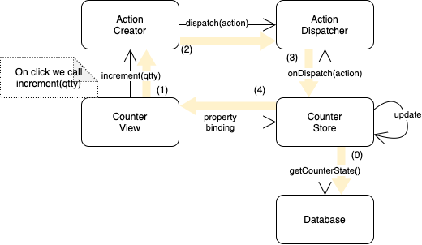

# Flux architecture style

> data flows through the application in a single direction — there are no two-way bindings

See <https://facebook.github.io/flux/docs/in-depth-overview#structure-and-data-flow>

## One way flow



Steps:

(0) when the counter store is lodaed, it fetches the state from database

```javascript
property int value: 0
Component.onCompleted: {
    value = database.getCounterState()
}
```

(1) when we click on the screen, the counter view calls `increment(qtty)` method from the action creator

```javascript
MouseArea {
    anchors.fill: parent
    onClicked: {
        actionCreator.increment(1)
    }
}
```

(2) action creator `increment` method creates an `action` object and calls action dispatcher `dispatch(action)`

```javascript
function increment(qtty) {
  var action = {
    type: "INC",
    inc: qtty,
  };
  dispatcher.dispatch(action);
}
```

(3) the counter store has subscribed to action dispatcher `dispatch` signal, and it updates its internal state when the signal is triggered

```javascript
Connections {
    target: dispatcher
    function onDispatch(action) {
        switch(action.type) {
            case 'INC':{
                value = value + action.inc
                break
            }
            // more action types
        }
    }
}
```

(4) the counter view has register itself to listen to the counter state using property bindings.

```javascript
required property CounterStore store
Text {
    text: "counter " + (store.value ?? 0) // property binding
}
```

When the ounter store updates its `value`, the Text component is rendered automatically.

**Bonus**
There's a component called `ExternalEvents` that decreases the counter every 1,5 seconds
