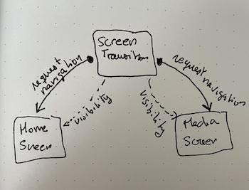

# Screen transitions

Transitions are triggered by either button presses (e.g. go to media screen) or Pacio events (e.g. flight is closed).
`ScreenTransitions.qml` holds the "state" of the screens: what's visible and what is not.
Screens use this component to show/hide themselves.

`ScreenTransitions.qml` subscribes to all possible events: navigation requests from different screens and Pacio events, and it updates its state (state of the screens).



```qml
// ScreenTransition.qml

    // example: listen to homeScreen requesting navigation to media screen
    Connections {
        target: homeScreen
        function onMediaNavigationRequested() {
            homeScreenVisible = false
            mediaScreenVisible = true
        }
    }
```

`main.qml` is the starting point, and `HomeScreen.qml` is the screen shown on startup.

Run by `QML2_IMPORT_PATH=. qmlscene main.qml`
